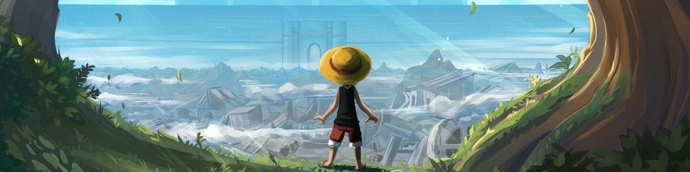
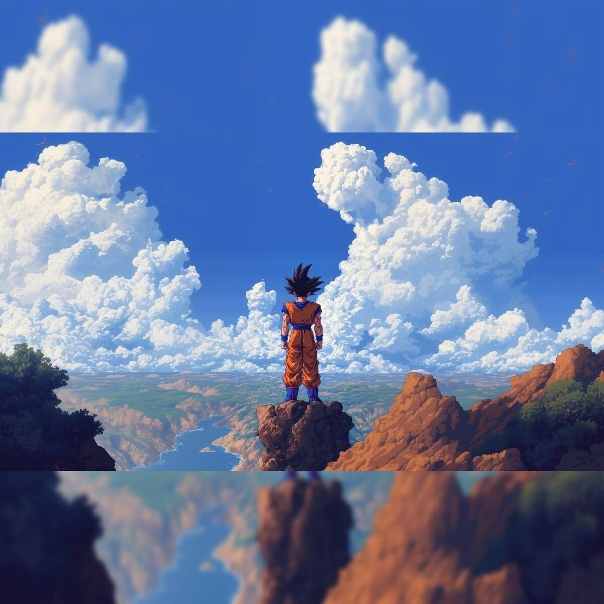

<!-- BANNER | One Piece Theme -->

  

<!-- Animated Skill Badges & Tech Stack Icons -->

  
  
  
  
  
  
  
  
  
  
  

<!-- SVG Wave Separator -->

  

---

# 👋 Welcome to My World!

> **Bholenath** | Jack of All Trades | Infinite Chances

<table>
  <tr>
    <td align="center">
      <b>🌟 Full-Stack Developer & Game Dev</b> 
       Based in India
    </td>
    <td align="center">
      <b>🗣️ Languages</b> 
      English | Hindi | Sanskrit | Japanese
    </td>
    <td align="center">
      <b>🎨 Designer | 🎬 Editor | 🎮 Game Creator</b> 
      <b>💻 Tech Stack:</b> React, Node.js, Unity, Unreal, Adobe Suite, and more
    </td>
  </tr>
</table>

---

<!-- STATS & ACTIVITY -->
## 🏆 GitHub Stats, Trophies & Activity

  
  
  
  
  

---

<!-- PROJECT SHOWCASE | Ready for GIFs, Cards -->
## 🚀 Featured Projects

  <!-- Project Card Example -->
  <table>
    <tr>
      <td align="center">
         
        <b>Infinite-Void (Coming Soon)</b> 
        <i>My next big game dev adventure. Stay tuned for live demo!</i>
      </td>
      <td align="center">
         
        <b>Future App #1</b> 
        <i>Space reserved for your first deployed app.</i>
      </td>
      <td align="center">
         
        <b>Future App #2</b> 
        <i>Space reserved for your second deployed app.</i>
      </td>
    </tr>
  </table>
   
  <b>More projects coming soon! Stay tuned for live demos. 🚧</b>

---

<!-- ABOUT ME | Fun Section -->
## 🎯 About Me

- 🧠 **Jack of All Trades:** Always learning, always building.
- 🌏 **Explorer:** Love to travel, drive, and live life to the fullest.
- 🥷 **Anime Enthusiast:**  
  "As long as I am alive, I have infinite chances."
- 🎵 **Now Playing:**  
  *Bulleya (Unplugged) by Papon*
- 🎬 **Favorite Quote:**  
  > "As long as I am alive, I have infinite chances."

---

<!-- ANIME | Personal Picks -->
## 📚 Anime Starter Kit

If you're new to anime, check these out:
- **Death Note** – The classic mind game
- **Attack on Titan** – Twists and thrill
- **One Punch Man** – Unbeatable fun
- **One Piece** – The ultimate adventure
- **Demon Slayer** – Animation perfection  
*Ping me for more recommendations!*

---

<!-- COLLABORATION & CONTACT -->
## 🤝 Collaboration & Contact

Open to freelance, mentoring, and open-source collabs!  
Connect via [LinkedIn](https://www.linkedin.com/in/gaurav-kumar-b53b38205?utm_source=share&utm_campaign=share_via&utm_content=profile&utm_medium=android_app)  
or email me at: **reachme.gauravkumar@gmail.com**

---

<!-- LEARNING GOALS -->
## 🧑‍💻 Learning Goals

Currently mastering **App Development**  
🚀 Deploying two new apps by the end of this year!

---

<!-- PORTFOLIO -->
## 🌐 Portfolio

**Website coming soon!**  
Stay tuned for updates.

---

<!-- FUTURE ACHIEVEMENTS | Reserved Spaces -->
## 🏅 Future Achievements & Highlights

  
  
  

- 🏆 **Major Tech Conference Speaker:** *(Space reserved for your first talk!)*
- 🥇 **Open Source Contribution:** *(Your first major PR goes here!)*
- 🚀 **Featured in Tech Media:** *(Spot reserved for your first interview or article!)*
- 🎮 **Game Launch:** *(Infinite-Void release coming soon!)*

---

<!-- SECRET SCROLL | Goku Image -->
## 📜 Secret Scroll

  
🔍 Open the Scroll for a Secret Message!

  

    
  

  <b>
    “The greatest adventure lies beyond the horizon. Seek, learn, and become limitless.”
  </b>

---

<!-- VISITOR COUNTER & SIGNATURE -->

  

  <b>Bholenath🕉️ | savagesnowboy</b>

---

<!-- EXTRAS & EASTER EGGS -->

  
✨ Easter Egg: Jack of All Trades

  <ul>
    <li>🛠️ Try to find the hidden reference in my codebase!</li>
    <li>🌌 DM me for a custom anime list or dev advice!</li>
    <li>🎲 Want to collaborate? Send a funny meme with your proposal!</li>
  </ul>

<!-- 
   - Add project GIFs, banners, and visuals as you grow.
   - Reserve spaces for future achievements, portfolio, and highlights.
   - Feel free to use animated SVGs, HTML tables, and advanced widgets for even more interactivity.
   - Update this README as you conquer new horizons!
-->
